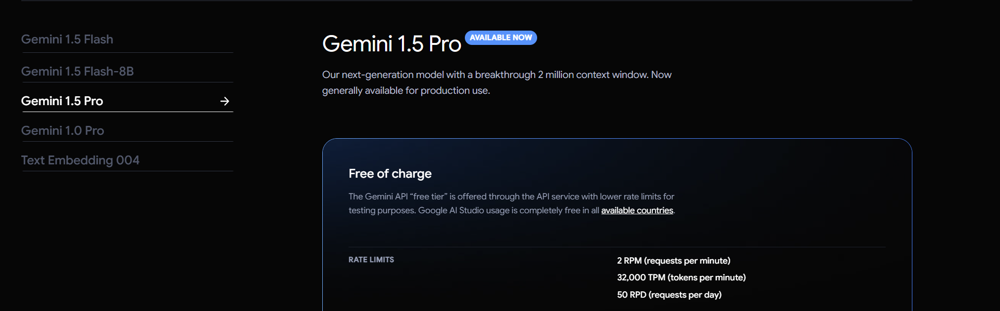
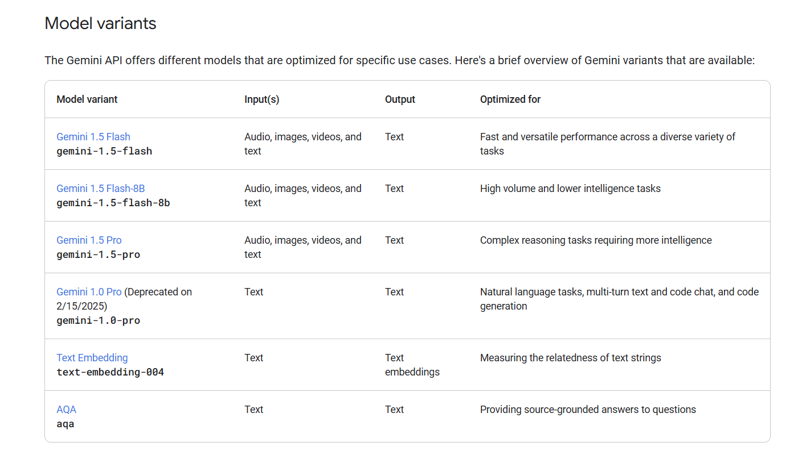

---

sidebar_position: 4
---

# Gemini Rate Limits
## Gemini Pricing and free tier Ratelimits

[Gemini Pricing and free tier Ratelimits](https://ai.google.dev/pricing#1_5pro)

## Gemini-1.5-pro Model Optimized For

[gemini-1.5-pro Docs](https://ai.google.dev/gemini-api/docs/models/gemini)

## why we choose gemini-1.5-pro
- Gemini-1.5-pro is optimized for complex reasoning and has higher intelligence than other models.

- For this case solving math problems requires complex reasoning and this model is best suited for that.

- It has better performance in most cases as compared to other models in problem solving.

## API running out of free tier credits
- The free tier rate limits are 2RPM , 32000 tokens per day and 50 requests per day.

- Currently we are using this even though it it is not for production unitl someone sponsor us .

- If you want to sponsor us you can contact me on [X(Twitter)](https://x.com/sreehariX) or [Linkedin](https://www.linkedin.com/in/sreehariX/)

- If we run out of free tier currently we are throwing "Sorry, there was an error processing your request. Most likely our free Gemini API credits are over. We'll be upgrading soon" error message.
