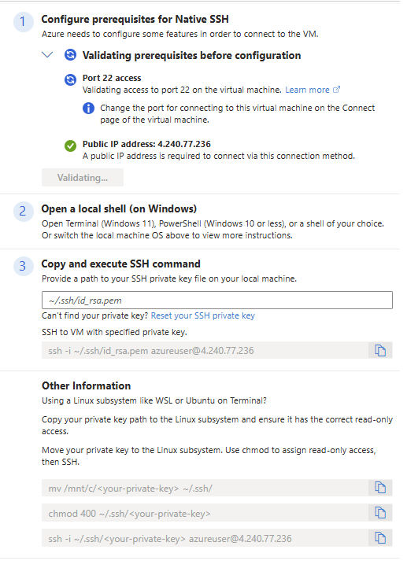

# Backend Azure EC2(Virtual Machine)

We are running the backend on Azure EC2(Virtual Machine).
- Operating System: Linux (ubuntu 24.04)
- size: Standard E2s v3 (2 vcpus, 16 GiB memory)
- Able to afford due to github student developer pack. I am currently learing best way to deploy fastapi application on cloud  rather than using VM
- But VM setup is not that complex.

## Initial Setup

- Create VM according to your requirements.
- connect using native ssh . I am using this for a long time and it is pretty good.



-- Install git:
```bash
sudo apt install git
```

- pull git repository to VM that has you backend code.

## Run the backend

- Install python and pip:
```bash
sudo apt update
sudo apt install python3 python3-pip
```


- Create and activate virtual environment:
```bash
python3 -m venv venv
source venv/bin/activate
```

- Install dependencies using pip:
```bash
pip install -r requirements.txt
```

- Run the application using uvicorn:
```bash
uvicorn main:app --host 127.0.0.1 --port 8000
```


## Configuring Apache server

- Install apache server:
```bash
sudo apt install apache2
sudo a2enmod ssl
sudo a2enmod proxy
sudo a2enmod proxy_http
sudo apt install certbot python3-certbot-apache
```

- Get SSL certificate:
```bash
sudo certbot --apache -d yourdomain.com
```

- Edit the SSL configuration file:
```bash
sudo nano /etc/apache2/sites-available/000-default-le-ssl.conf
```

Add the following configuration:
```apache
<IfModule mod_ssl.c>
<VirtualHost *:443>
    ServerAdmin webmaster@localhost
    ServerName yourdomain.com

    DocumentRoot /var/www/html

    ErrorLog ${APACHE_LOG_DIR}/error.log
    CustomLog ${APACHE_LOG_DIR}/access.log combined

    SSLEngine on
    SSLCertificateFile /etc/letsencrypt/live/yourdomain.com/fullchain.pem
    SSLCertificateKeyFile /etc/letsencrypt/live/yourdomain.com/privkey.pem
    Include /etc/letsencrypt/options-ssl-apache.conf

    # Reverse proxy settings
    ProxyRequests Off
    ProxyPass / http://127.0.0.1:8000/
    ProxyPassReverse / http://127.0.0.1:8000/

    <Proxy *>
        Require all granted
    </Proxy>
</VirtualHost>
</IfModule>
```

:::note
Replace `yourdomain.com` with your actual domain name in all places.
:::

- Restart apache server:
```bash
sudo systemctl restart apache2
```

- check the api on browser `https://yourdomain.com/` it should work.

## Running fastapi service on VM

- after this configuration if everything is fine you can stop the local host server and run fastapi service . Basically even if you close the terminal it will run on the VM.


- Create a systemd service for fastapi:
```bash
sudo nano /etc/systemd/system/fastapi.service
```

Add the following configuration:
```ini
[Unit]
Description=FastAPI application
After=network.target

[Service]
User=azureuser
Group=azureuser
WorkingDirectory=/home/azureuser/mathmate-backend
Environment="PATH=/home/azureuser/mathmate-backend/venv/bin"
ExecStart=/home/azureuser/mathmate-backend/venv/bin/uvicorn main:app --host 127.0.0.1 --port 8000

[Install]
WantedBy=multi-user.target
```

:::note
Replace `azureuser` and paths with your actual username and project directory paths.
:::

- Enable and start the service:
```bash
sudo systemctl enable fastapi
sudo systemctl start fastapi
```

- Check service status:
```bash
sudo systemctl status fastapi
```


- Now you can access the api on browser `https://yourdomain.com/` it should work.
