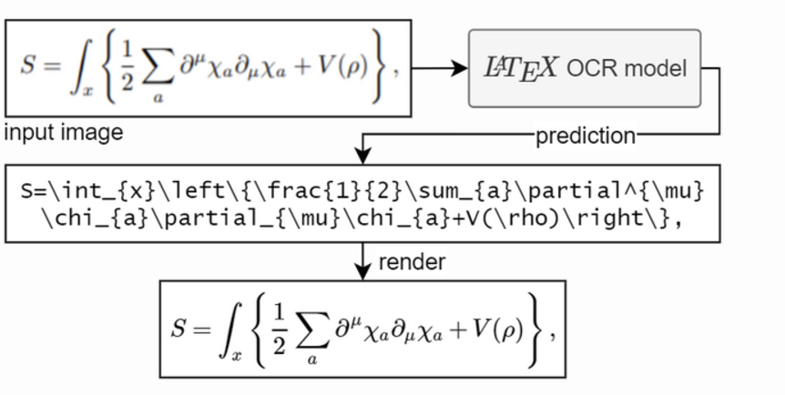

# Overview

I wrote this docs to maintain this project and also in way that will help me when i am deploying next time using vercel and azure VM 

# MathMate AI Project Overview

The idea is pretty simply , I want to create a math tutor for people where they can ask and learn math without any judgement they can ask as many questions as they want and they can learn math in a fun way.

These are the features I implemented so far:

- **Math Assistant**: Solves mathematical problems with detailed step-by-step explanations by using gemini-1.5-pro API
- **Image Recognition**: Converts eqation in image to latex code by using pix2tex python library
- **Graphing Calculator**: Interactive plotting of mathematical functions by using desmos API [Desmos API link](https://www.desmos.com/api/v1.6/docs/index.html) I used demo API for this ,they also offer production API .
- **Authentication**: Google OAuth integration for user management
- **Rate Limiting**: Free tier with limited requests for non-authenticated user

## Technical Architecture

### Frontend (React + TypeScript)
The frontend is built using:
- React with TypeScript
- Vite as the build tool
- Tailwind CSS for styling
- Zustand for state management
- React Router for navigation

### Backend (FastAPI)
The backend utilizes:
- FastAPI framework
- SQLAlchemy for database operations (just for saving google oauth gmail and name)
- Google's Gemini AI for problem-solving
- Pix2Tex for equation image recognition [Pixtotex Python Package Link](https://pypi.org/project/pix2tex/) 

## Core Components

### 1. Math Assistant
- Processes both text and image inputs
- Uses Gemini AI for step-by-step solutions
- Supports LaTeX rendering
- Implements rate limiting for free tier users

### 2. Graphing Calculator
- Built with Desmos API integration
- Supports multiple expressions
- Interactive viewport controls
- Real-time graph updates

### 3. Authentication System
- Google OAuth 2.0 integration
- JWT-based session management
- Persistent user sessions
- Protected routes for authenticated features

## API Integration

### Backend Endpoints:
- `/solve-equation/`: Processes image-based equations
- `/solve-text/`: Handles text-based mathematical queries
- `/auth/google`: Manages Google authentication
- `/health`: System health monitoring

### External APIs:
- Google OAuth
- Gemini AI
- Desmos Calculator API

